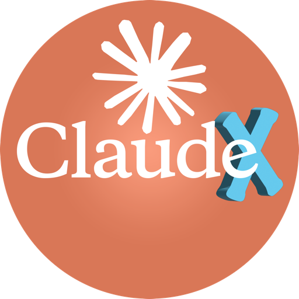
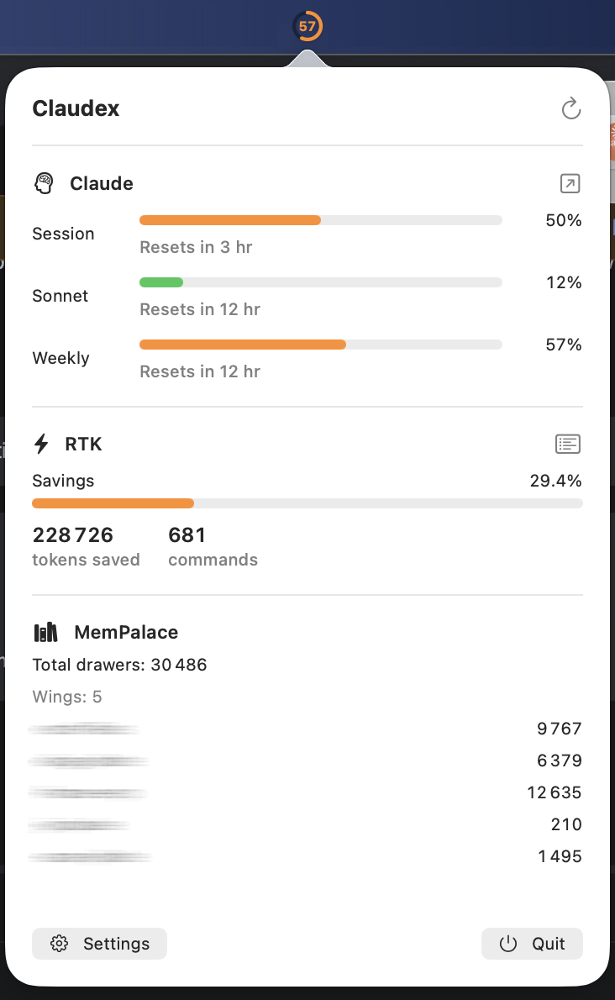
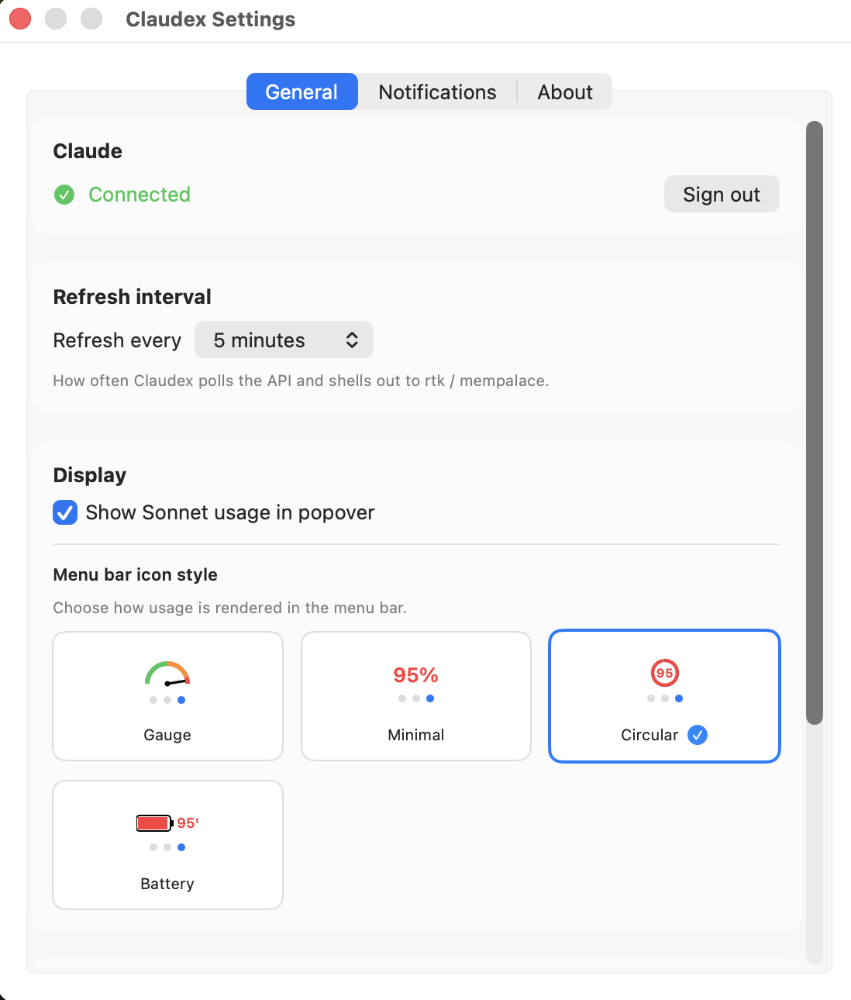
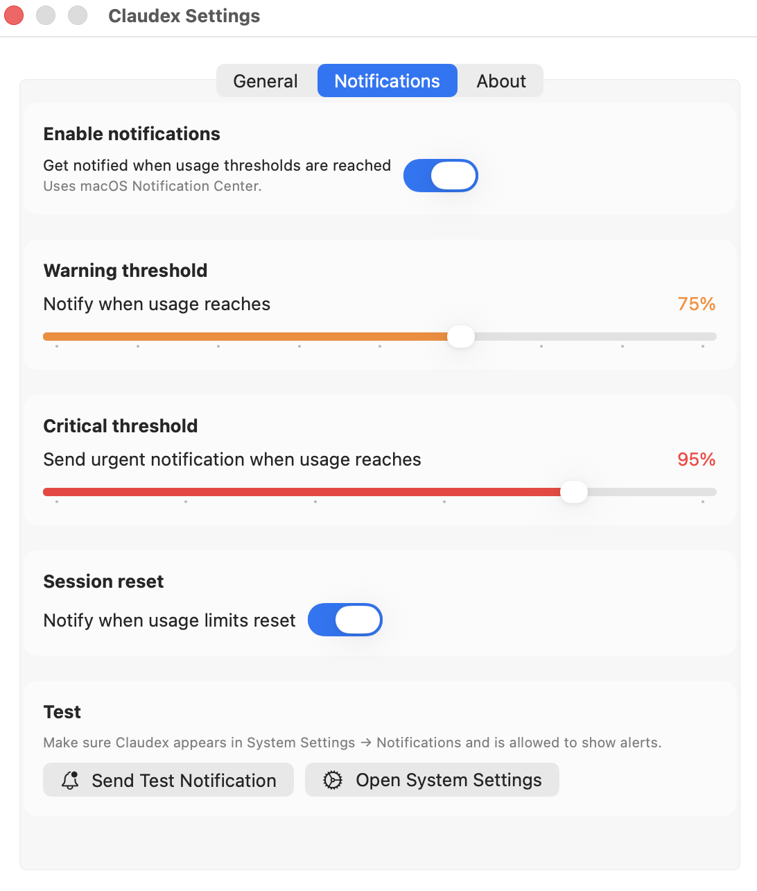

<div align="center">



# Claudex

**One macOS menu bar, four usage stats: [Claude.ai](https://claude.ai), [RTK](https://github.com/rtk-ai/rtk), [Caveman](https://github.com/jarodxxx/caveman), and [MemPalace](https://github.com/mempalace/mempalace).**

[](LICENSE)
[](#requirements)
[](#requirements)
[](https://github.com/jarodxxx/Claudex/releases)

</div>

---

## What it is

Claudex is a macOS menu bar app that aggregates the usage stats of three tools
you probably already use as a Claude Code power user:

- **Claude.ai** — your 5-hour session, weekly, and Sonnet quotas
- **[RTK](https://github.com/rtk-ai/rtk)** — token savings from the CLI proxy that compresses your bash output
- **[Caveman](https://github.com/jarodxxx/caveman)** — token volumes, cache hit rate, cost estimate, and tool call counts read directly from Claude Code session files (no binary required)
- **[MemPalace](https://github.com/mempalace/mempalace)** — drawer/wing counts of your local-first AI memory

One glance at the menu bar tells you where you stand on all three. Open the
popover for a detailed breakdown.

You don't need all three services installed — Claudex shows what's available
and quietly hides the rest.

## Features

- **Live menu bar indicator** — colored gauge that turns green / orange / red as
  the highest of your three quotas climbs
- **6 menu bar icon styles** — Gauge, Minimal, Circular, Battery, Segments,
  Dual Bar (configurable in Settings, with live preview)
- **Detailed popover** — per-period progress bars with reset countdowns,
  RTK savings + token counts, Caveman cache hit rate + cost estimate, MemPalace wing breakdown
- **Tool cards UI** — each service displayed in its own card with rounded corners
  and subtle shadow for clear visual separation
- **Native macOS notifications** — configurable warning/critical thresholds,
  reset alerts
- **Two sign-in methods for Claude** — embedded WebKit window for
  email/password accounts, or manual paste from DevTools (works with Google
  SSO too)
- **In-app updater** — "Update Now" button in Settings → About; runs
  `brew upgrade --cask claudex` directly (or opens the release page for manual installs)
- **Auto-detect** — `rtk` and `mempalace` binaries are picked up via
  `which` automatically, override with a path picker
- **Stats export** — writes `~/.claudex/usage.json` after every refresh so
  shell prompts, dashboards, or status-line scripts can consume the same data
- **Dark / light mode aware** — icon and popover follow the system
  appearance, including live re-rendering when you toggle modes

## Screenshots

### Menu bar + popover

The icon lives in your menu bar and turns green / orange / red as your
highest quota climbs. Click it to open the detailed popover.

<p align="center">
  
</p>

### Settings — General

Pick your refresh interval, toggle Sonnet display, and choose your menu bar
icon style with a live preview that cycles through the three usage zones.

<p align="center">
  
</p>

### Settings — Notifications

Configure warning and critical thresholds, opt in to reset notifications,
and run a test alert to confirm everything is wired up.

<p align="center">
  
</p>

## Requirements

- macOS 14.0 (Sonoma) or later
- An active **Claude.ai** account (Pro or higher)
- Optional: [`rtk`](https://github.com/rtk-ai/rtk) installed (Claudex auto-detects via `which rtk`)
- Optional: [`mempalace`](https://github.com/mempalace/mempalace) installed (idem)

To build from source: Xcode 16+ and [XcodeGen](https://github.com/yonaskolb/XcodeGen).

## Installation

Three ways to install Claudex, in increasing order of effort. **Most users
should pick option 1.**

### Option 1 — Homebrew Cask (recommended)

If you don't have Homebrew, install it first from
[brew.sh](https://brew.sh) (one paste in your Terminal).

Then:

```bash
brew install --cask jarodxxx/tap/claudex
```

That's it. Homebrew downloads the signed `.dmg` from GitHub Releases,
verifies its checksum, and installs `Claudex.app` into `/Applications/`.

**Launch the app:**
- Open Spotlight (`⌘ Space`), type `Claudex`, hit `Enter`
- OR open the **Applications** folder in Finder and double-click Claudex

The app is signed with an Apple Developer ID and notarized by Apple —
**no Gatekeeper warning** will appear on first launch.

The first time it runs, an onboarding wizard helps you connect your
services — see [Configuration](#configuration) below.

**To upgrade** (when a new version is released):

From inside the app: **Settings → About → Update Now** (v2.1.0+).

Or from Terminal:
```bash
brew upgrade --cask claudex
```

**To uninstall** (removes the app + cached data + preferences):
```bash
brew uninstall --cask claudex
```

### Option 2 — Manual `.dmg` download

If you don't want Homebrew:

1. Open the [latest GitHub Release](https://github.com/jarodxxx/Claudex/releases/latest)
2. Download `Claudex-<version>.dmg` (under "Assets")
3. Double-click the `.dmg` to mount it
4. Drag `Claudex.app` onto the **Applications** shortcut inside the disk image
5. Eject the mounted disk (right-click on Desktop → Eject)
6. Launch Claudex from Spotlight or Applications

Same as option 1: the app is signed and notarized, no Gatekeeper warning.

### Option 3 — Build from source (contributors only)

For people who want to hack on Claudex itself:

```bash
brew install xcodegen
git clone https://github.com/jarodxxx/Claudex.git
cd Claudex
./scripts/dev-install.sh
```

This script generates `Claudex.xcodeproj` via XcodeGen, builds with your
own Apple Development certificate (set your team ID in `project.yml` if it
differs from the default), installs to `/Applications/Claudex.app`, and
launches it.

> **Why install to `/Applications/`?** macOS refuses notifications to apps
> running from a non-stable path like `~/Library/Developer/Xcode/DerivedData/`.

See [docs/RELEASE.md](docs/RELEASE.md) for the public release pipeline
(GitHub Actions → notarization → DMG → Homebrew Cask auto-bump).

## Configuration

On first launch a 3-card wizard lets you connect each service. You can
re-open it any time from **Settings → General**.

### Claude

Two sign-in methods, choose what fits your account:

#### 1. Web sign-in (recommended for email/password accounts)

Click **"Sign in to Claude"**. A WebKit window opens on `claude.ai/login`,
you authenticate normally, the `sessionKey` cookie is captured and saved to
the macOS Keychain. The cookie never leaves your device.

> **Heads up:** Google SSO is blocked inside embedded browsers by Anthropic.
> If your Claude account uses Google SSO, use method 2 instead.

#### 2. Manual paste (works with Google SSO)

Open `claude.ai` in your browser, find the `sessionKey` cookie in DevTools,
paste it in Claudex.

**Firefox:** F12 → **Storage** tab → Cookies → `https://claude.ai` → click
`sessionKey` → copy the **Value** column.

**Chrome / Edge:** F12 → **Application** → Cookies → `https://claude.ai` →
copy `sessionKey` value.

**Safari:** enable Developer menu first (**Settings → Advanced → Show
features for web developers**), then ⌥⌘I → **Storage** → Cookies →
`sessionKey`.

Claudex auto-detects when a valid `sk-ant-…` value is in your clipboard and
pre-fills the field.

### RTK

Auto-detected via `which rtk`. If you installed RTK in a non-standard
location, override the path in **Settings → General → RTK**.

### MemPalace

Same — auto-detected via `which mempalace`, override in Settings if needed.

## Daily use

- **At a glance** — the menu bar icon color reflects the highest of your
  three Claude quotas (green < 50% < orange < 90% < red).
- **Click the icon** for the detailed popover: progress bars with reset
  countdowns, RTK savings %, MemPalace drawer counts.
- **Click "Refresh"** for an immediate update; otherwise Claudex polls
  every minute (configurable: 1 / 5 / 15 / 30 min).
- **Notifications** — opt-in alerts when quotas cross your warning or
  critical threshold (configurable in Settings → Notifications).

## External integration

After every refresh, Claudex writes a snapshot of all known stats to
`~/.claudex/usage.json`. Shell prompts, statusline scripts and dashboards
can consume it without polling Claude.ai themselves.

```json
{
  "last_updated": "2026-05-04T20:00:00Z",
  "claude": {
    "last_updated": "...",
    "session_usage": { "reset_at": "...", "utilization": 31 },
    "sonnet_usage":  { "reset_at": "...", "utilization": 12 },
    "weekly_usage":  { "reset_at": "...", "utilization": 55 }
  },
  "rtk": {
    "summary": {
      "total_commands": 637,
      "total_saved": 207770,
      "avg_savings_pct": 27.6
    }
  },
  "mempalace": {
    "total_drawers": 30486,
    "wings": [
      { "name": "certi-files", "rooms": [{ "name": "general", "drawers": 9767 }] }
    ]
  }
}
```

Sections may be `null` if the corresponding service is not configured or
its last refresh failed. The Claude section mirrors the
[ClaudeMeter](https://github.com/eddmann/ClaudeMeter) schema for
drop-in compatibility with existing scripts.

### Example — Claude Code statusline

`~/.claude/statusline.sh`:

```bash
#!/bin/bash
usage=$(jq -r '.claude.session_usage.utilization // "?"' ~/.claudex/usage.json 2>/dev/null)
[ -z "$usage" ] || [ "$usage" = "null" ] && usage="?"
echo "Claude: ${usage}%"
```

`~/.claude/settings.json`:

```json
{
  "statusLine": {
    "type": "command",
    "command": "bash ~/.claude/statusline.sh"
  }
}
```

## Architecture

```
Claudex.app
├── ClaudexApp.swift           @main entry point
├── AppDelegate.swift          NSStatusItem + lifecycle
├── Menu/                      menu bar UI (icon, popover)
├── Sources/
│   ├── Claude/                claude.ai web API client
│   ├── RTK/                   shells out to `rtk gain --format json`
│   ├── Caveman/               reads ~/.claude/projects/**/*.jsonl directly
│   └── MemPalace/             shells out to `mempalace status`
├── Config/                    Keychain (sessionKey), UserDefaults (paths/prefs)
├── Settings/                  General / Notifications / About tabs
├── Onboarding/                first-launch wizard
├── Refresh/                   StatsAggregator + Timer + UsageNotifier
└── Actions/                   CommandRunner + system notifications
```

- One folder per integrated service, no cross-talk between them.
- Aggregation happens in `StatsAggregator`; the UI layer just renders.
- Secrets live **only** in Keychain (`com.claudex.app`), never on disk.
- Process launches use the `ProcessRunning` protocol so unit tests can
  stub them.

See [docs/architecture.md](docs/architecture.md) for the full diagram.

## Building from source

```bash
brew install xcodegen           # one-time
git clone https://github.com/jarodxxx/Claudex.git
cd Claudex

# Generate Claudex.xcodeproj (regenerated locally; not committed)
xcodegen generate

# Edit project.yml -> DEVELOPMENT_TEAM if you want your own signing.
# Without a team, build with: xcodebuild ... CODE_SIGNING_ALLOWED=NO build
# (notifications won't work — see "Why install to /Applications" above)

./scripts/dev-install.sh
```

Run the test suite:

```bash
swift test --parallel --num-workers 1
```

(`--num-workers 1` because the Keychain tests share a single item per
service name and would race in parallel.)

See [docs/xcode-setup.md](docs/xcode-setup.md) for the full Xcode workflow.

## Contributing

Ideas and bug reports → [GitHub Issues](https://github.com/jarodxxx/Claudex/issues).
PRs welcome — please open an issue first if it's a non-trivial change.
See [docs/RELEASE.md](docs/RELEASE.md) for the release process.

## Disclaimer

**Claudex is unofficial** and is not affiliated with, endorsed by, or
supported by Anthropic, the RTK project, or the MemPalace project.

Claudex talks to the **Claude.ai web API** using browser-based session
cookies. **This may violate Anthropic's Terms of Service.** By using
Claudex you acknowledge that:

- Anthropic may block, restrict, or terminate access at any time
- Your Claude account could be affected by using unofficial API clients
- **Use at your own risk** — the developer assumes no liability

**Data storage:**

- The Claude session key is stored in the macOS Keychain (encrypted,
  device-local only)
- All other prefs are in `UserDefaults` (`com.claudex.app` domain)
- Aggregated stats are written to `~/.claudex/usage.json` (plain JSON,
  utilization percentages only)
- **No data is sent to any third party** — Claudex talks only to
  `claude.ai`, `rtk`, and `mempalace`

This software is provided "as is" under the MIT License, without warranty
of any kind.

## Credits

Claudex stands on the shoulders of three excellent projects:

- **[ClaudeMeter](https://github.com/eddmann/ClaudeMeter)** by Edd Mann (MIT)
  — the original menu bar app for Claude.ai usage. Claudex re-implements the
  Claude.ai client by reading ClaudeMeter's open-source Swift code, and
  preserves its `usage.json` schema.
- **[RTK](https://github.com/rtk-ai/rtk)** by the rtk-ai team (MIT) — the CLI
  proxy whose stats Claudex surfaces.
- **[MemPalace](https://github.com/mempalace/mempalace)** by the MemPalace
  team (MIT) — the local-first AI memory whose drawer counts Claudex shows.

## License

[MIT](LICENSE) — © 2026 Avi Teboul.
